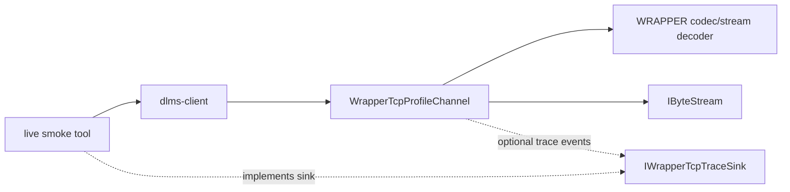
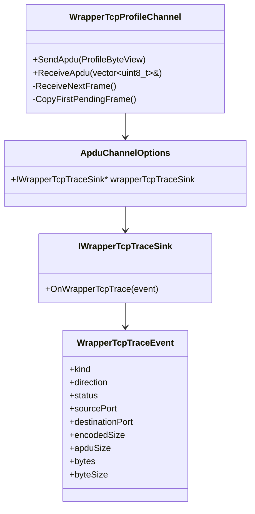

# Wrapper/TCP Trace Plan

## Goal

Provide an opt-in diagnostic hook for `WrapperTcpProfileChannel` so live tools
can explain WRAPPER legacy association failures on real meters.

The first consumer is the root `dlms_live_meter_smoke` tool. The immediate
diagnostic need is to distinguish these cases:

- AARQ WPDU is not written;
- meter closes the TCP connection after AARQ;
- meter sends bytes that do not decode as a WRAPPER frame;
- meter sends a WRAPPER frame with unexpected source or destination ports;
- meter sends a valid WRAPPER frame whose APDU later fails ACSE decoding.

## Requirements

- Trace is disabled by default.
- Trace is configured by the caller through `ApduChannelOptions`.
- Trace must not change channel behavior or ownership.
- Existing callers must compile without source changes.
- Trace must include non-secret WRAPPER metadata:
  - event kind;
  - direction;
  - mapped `ProfileStatus`;
  - local and remote wrapper ports;
  - encoded frame size;
  - APDU size.
- Trace may expose a bounded prefix of encoded bytes for diagnostics, but live
  tooling must default to metadata-only output.
- Trace must not print passwords, keys, system titles, invocation counters, or
  full APDU payloads.
- First implementation is C++ API only. C API support is out of scope.

## C++ API Sketch

```cpp
enum class WrapperTcpTraceDirection
{
  Outbound,
  Inbound
};

enum class WrapperTcpTraceKind
{
  EncodedFrame,
  DecodedFrame,
  ReadStatus,
  DecodeStatus
};

struct WrapperTcpTraceEvent
{
  WrapperTcpTraceKind kind;
  WrapperTcpTraceDirection direction;
  ProfileStatus status;
  std::uint16_t sourcePort;
  std::uint16_t destinationPort;
  std::size_t encodedSize;
  std::size_t apduSize;
  const std::uint8_t* bytes;
  std::size_t byteSize;
};

class IWrapperTcpTraceSink
{
public:
  virtual ~IWrapperTcpTraceSink() {}
  virtual void OnWrapperTcpTrace(const WrapperTcpTraceEvent& event) = 0;
};
```

`ApduChannelOptions` gains nullable `IWrapperTcpTraceSink* wrapperTcpTraceSink`.
`DefaultApduChannelOptions()` initializes it to null.

The `bytes` pointer is a non-owning view valid only during the callback. Channel
code does not copy trace payload. Callers that need persistence must copy the
bounded data themselves.

## Architecture





## Test Plan

- `DefaultApduChannelOptions` leaves `wrapperTcpTraceSink` null.
- `SendApdu()` emits one outbound `EncodedFrame` event after successful WRAPPER
  encoding and before transport write.
- `ReceiveNextFrame()` emits inbound `ReadStatus` when the byte stream read
  fails before a frame is decoded.
- `ReceiveNextFrame()` emits inbound `DecodeStatus` when the stream decoder
  returns a non-`NeedMoreData` failure.
- `ReceiveNextFrame()` emits one inbound `DecodedFrame` event per decoded
  WRAPPER frame with source/destination ports and APDU size.
- Trace disabled path keeps existing tests and behavior unchanged.
- Root live smoke can print metadata-only trace for WRAPPER legacy association.

## Phase Commit Message

```text
docs(profile): define Wrapper TCP trace hook

Document an opt-in WrapperTcpProfileChannel trace hook for diagnosing live
WRAPPER legacy association failures. The plan defines the non-secret event
boundary, C++ API shape, channel integration points, and tests for outbound
frames, read failures, decode failures, and decoded inbound frames.

Verification: documentation-only phase.
```
