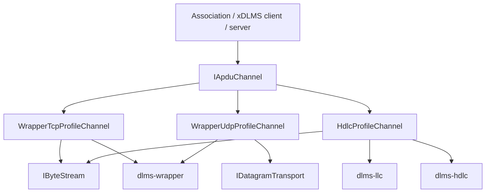
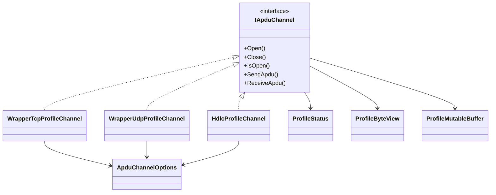

# Profile Architecture

## Scope

`dlms-profile` binds DLMS/COSEM APDU bytes to concrete communication profiles.
It sits below association/client/server layers and above wrapper, LLC, HDLC,
and transport libraries.

## Dependencies

```text
dlms-profile
  -> dlms-transport
  -> dlms-wrapper
  -> dlms-llc
  -> dlms-hdlc
```

There is no dependency on `dlms-apdu`.

## Public Modules

- `profile_types`: status, byte views, options.
- `apdu_channel`: `IApduChannel`.
- `wrapper_tcp_profile_channel`.
- `wrapper_udp_profile_channel`.
- `hdlc_profile_channel`.
- `profile_c_api`.

## Layer Diagram



## Class Interaction Diagram



## TCP Receive State

```text
ReadSome -> WrapperStreamDecoder::Push
  NeedMoreData -> keep buffered bytes and read again later
  Ok + frame -> return frame.data as APDU
  error -> reset decoder and return mapped status
```

## HDLC Receive State

```text
ReadSome -> HdlcStreamDecoder::Push
  NeedMoreData -> keep buffered bytes and read again later
  Ok + frame -> DecodeLpdu(frame.information) -> return lpdu.lsdu
  error -> reset decoder and return mapped status
```

## HDLC Session Receive State

When `hdlcUseSession` is enabled, HDLC receive is data-link-session aware:

```text
Open -> stream open only
Client ConnectDataLink -> SNRM write -> UA read/retry -> HdlcSession connected
Server AcceptDataLink -> SNRM read -> UA write -> HdlcSession connected

ReadSome -> HdlcStreamDecoder::Push
  complete frame -> HdlcReassembler::PushFrame
  segmented partial -> keep reading
  completed I-frame -> HdlcSession::ReceiveFrame
                    -> DecodeLpdu(completed.information)
                    -> queue APDU
                    -> RR write
  S/R/U-frame -> HdlcSession::ReceiveFrame and continue
```

Session-mode send chunks the LLC LPDU by the negotiated transmit information
field size. Each chunk is built as an `HdlcSession` I-frame, non-final chunks
set the HDLC segmentation bit, and the channel waits for RR when the negotiated
window requires acknowledgement before more frames are sent.

The profile layer still does not inspect ACSE or xDLMS APDU contents.

## Error Model

Profile APIs return `ProfileStatus`. Lower-layer statuses are mapped without
leaking lower-layer enum types into the profile public contract.

## Test Strategy

Unit tests use fake transports. Root integration tests combine profile channels
with APDU encoding/decoding at the test assertion boundary.
